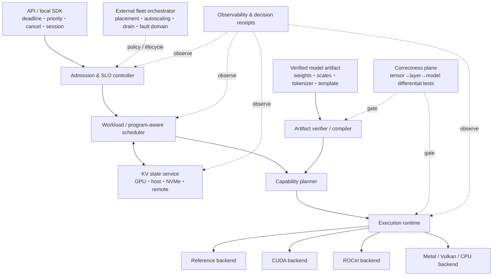

# LLM推論エンジン群の詳細比較と、ユーザーが真に必要とする理想の推論エンジン

調査日: 2026-07-10（Asia/Tokyo）  
対象: llama.cpp、vLLM、SGLang、TensorRT-LLM、ROCm/ATOM  
目的: 既存製品の優劣を一列に並べるのではなく、それぞれが何を最適化し、何を利用者側へ押し戻しているかを明らかにし、uLLMが狙うべき空白を定義する。

## エグゼクティブサマリー

結論から言えば、現在の主要LLM推論エンジンには「総合優勝者」はいない。各エンジンは異なる問題に対する局所最適解である。

- **llama.cpp** は、GGUFを中心としたローカル実行、少ない依存、CPUを含む広いハードウェア、低ビット量子化で最も強い。
- **vLLM** は、PagedAttention、continuous batching、広いモデル/API/分散機能をまとめた汎用サービング基盤として最も厚い。
- **SGLang** は、prefix再利用、structured generation、prefill/decode分離、RL・agent系ワークロードまで含む「状態を再利用するサービング」で強い。
- **TensorRT-LLM** は、NVIDIA GPU、特に新しいデータセンターGPUの性能を引き出す垂直統合で強い。
- **ROCm/ATOM** は、AITERを通じてAMD GPU向け最適化を素早く利用する、比較的軽量なAMD-firstエンジンとして独自の価値がある。

しかし、ユーザーが本当に欲しいものは「ベンチマークで最大のtok/sを出す第6のエンジン」ではない、というのが本稿の設計仮説である。必要なのは、次の成果を同時に提供する**信頼できる推論オペレーティング層**である。

1. モデルを初回から正しく読み、同じartifactから同じ意味の計算をする。
2. 自分のGPUで何が使え、何が使えないかを起動前に説明する。
3. peak throughputではなく、TTFT、TPOT、tail latency、goodput、fairnessを要求に合わせて制御する。
4. prefix/KVをGPUメモリだけの一時バッファではなく、寿命・所有者・再利用価値を持つ状態として管理する。
5. fallback、kernel選択、量子化、メモリ見積り、品質差を観測可能にする。
6. ローカルPCでは一コマンドで、クラスタでは同じ契約のまま分散できる。
7. upgrade、cancel、OOM、worker障害を「運用者が手で直す例外」にしない。

この空白を埋める設計は、全GPUで同じkernelを使う巨大な単一runtimeではない。**安定した制御面・artifact契約・正しさ契約**と、CUDA、ROCm、Metal、Vulkan、CPU等の**交換可能な実行backend**を分けるべきである。「portable performance」ではなく、まず「portable semantics」を保証し、その上で各ベンダーの高速経路を選ぶのが現実的な理想像である。

uLLMにとっての有力なengineering wedgeは、vLLMやSGLangの全機能を追うことではない。まずR9700/gfx1201とV620/gfx1030、Qwen3/Qwen3.5に対象を絞り、**元checkpointからkernel選択まで検証可能な実行artifact**、独立oracle・reference経路・高速経路の多重差分検証、silent fallbackの禁止、実servingの予測可能性で差別化することである。これが市場の「勝ち筋」かどうかは、後述する利用者検証を別途必要とする。

## 1. 調査範囲と読み方

### 1.1 情報源の優先順位

本レポートは、次の順序で根拠を重く扱った。

1. 各プロジェクトの公式repository、公式documentation、固定commitのsource snapshot
2. 設計の由来となる査読論文・学会発表
3. このworkspaceに保存されたsourceとR9700実測結果
4. 上記から導いた評価・設計上の考察

公式READMEに列挙された機能は「その機能が存在する」という根拠にはなるが、全モデル・全GPU・全組合せで同じ成熟度や性能を持つことまでは意味しない。そのため、本稿では**公式事実**と**本レポートの評価**をできる限り分けて記す。

### 1.2 固定したsource snapshot

急速に変化するproject同士を比較するため、workspace内のsource snapshotを基準にした。

| Engine | 調査snapshot | 主license | 設計中心 |
| --- | --- | --- | --- |
| llama.cpp | local `dd53c2e`、upstream base [`6c5de1c`](https://github.com/ggml-org/llama.cpp/tree/6c5de1cc83537bce5616ed08474f6fe119973a27), local commit 2026-07-07 | [MIT](https://github.com/ggml-org/llama.cpp/blob/6c5de1cc83537bce5616ed08474f6fe119973a27/LICENSE) | ローカル・portable・GGUF |
| vLLM | [`5b4cb69`](https://github.com/vllm-project/vllm/tree/5b4cb6952310ff20e054818eb34b8e70d3c06a1e), 2026-06-29 | [Apache-2.0](https://github.com/vllm-project/vllm/blob/5b4cb6952310ff20e054818eb34b8e70d3c06a1e/LICENSE) | 汎用高throughput serving |
| SGLang | [`3add35e`](https://github.com/sgl-project/sglang/tree/3add35e26dc0623d6647e226de7d17754bb61804), 2026-06-30 | [Apache-2.0](https://github.com/sgl-project/sglang/blob/3add35e26dc0623d6647e226de7d17754bb61804/LICENSE) | prefix/state再利用と高度なserving |
| TensorRT-LLM | [`92147d6`](https://github.com/NVIDIA/TensorRT-LLM/tree/92147d6e01d7d33b579558548e54cab1e848961d), 2026-06-30 | [Apache-2.0を中心にthird-party別条件](https://github.com/NVIDIA/TensorRT-LLM/blob/92147d6e01d7d33b579558548e54cab1e848961d/LICENSE) | NVIDIA向け垂直最適化 |
| ROCm/ATOM | [`cce1a6e`](https://github.com/ROCm/ATOM/tree/cce1a6e56dcd8cb300183f81901fdaed6090d951), 2026-06-30 | [MIT](https://github.com/ROCm/ATOM/blob/cce1a6e56dcd8cb300183f81901fdaed6090d951/LICENSE) | AMD/AITER向け軽量serving |

llama.cppの`dd53c2e`は、upstream `6c5de1c`へローカルbenchmark計測commitを一つ加えたsnapshotで、upstream GitHubには存在しない。このため表では両者を分けた。licenseはrepository rootの概略である。配布物へ組み込む場合は、third-party kernel、生成binary、model、containerごとに再確認が必要である。

調査日現在の公開releaseは、llama.cpp [`b9947`](https://github.com/ggml-org/llama.cpp/releases/tag/b9947)、vLLM [`v0.24.0`](https://github.com/vllm-project/vllm/releases/tag/v0.24.0)、SGLang [`v0.5.14`](https://github.com/sgl-project/sglang/releases/tag/v0.5.14)、TensorRT-LLM stable [`v1.2.1`](https://github.com/NVIDIA/TensorRT-LLM/releases/tag/v1.2.1)、ROCm/ATOM stable [`v0.1.5`](https://github.com/ROCm/ATOM/releases/tag/v0.1.5)である。上表のsnapshotは手元でsourceも監査できる固定点であり、latest releaseと意図的に分けた。`main`、RC、stable documentationには機能差があるため、「projectが現在開発中の機能」と「選んだreleaseで利用できる機能」も分けなければならない。

引用表記は、固定commit linkを優先し、調査日現在の機能しか説明できない場合だけ`stable`/`latest`/`main`等のlive documentationを使った。後者は2026-07-10に確認したmoving targetであり、将来同じURLの内容が変わり得る。特にTensorRT-LLMのstable/RC/main移行と、SGLangのcurrent HiCache/Gatewayは、固定6月末snapshotの事実とは区別して本文へ明記した。

### 1.3 「ATOM」の同定

同名projectが二つあるため注意が要る。

- 本稿でいう **ATOM** は、AMDの [`ROCm/ATOM`](https://github.com/ROCm/ATOM)（AiTer Optimized Model）である。vLLMに似たserving engineとしてAITER kernelを利用するため、今回の他4エンジンとの比較対象に合う。
- [`efeslab/Atom`](https://github.com/efeslab/Atom) は、W4A4量子化を扱う[MLSys 2024の研究](https://arxiv.org/abs/2310.19102)の実装である。重要なquantization研究だが、独立したonline serving engineではなく、著者もserving frameworkと直交する技術として位置づけている。

したがって、ユーザーの列挙意図はROCm/ATOMと判断した。後者を比較表へ混ぜると、engineとquantization methodを比較するcategory errorになる。

### 1.4 評価指標

推論性能を一つのtok/sへ圧縮すると、利用者の体験を誤る。最低限、次を分ける必要がある。

| 指標 | 意味 | 利用者にとっての意味 |
| --- | --- | --- |
| TTFT | request到着から最初のtokenまで | 応答が始まる速さ。queueとprefillの影響が大きい |
| TPOT | 2 token目以降の平均出力間隔 | streaming中の読み心地 |
| ITL分布 | token間latencyのp50/p95/p99等 | 途中で固まる現象を捉える |
| Throughput | 単位時間のinput/output token | 総処理量。ただし同時数・長さ・metric定義に依存 |
| Goodput | SLOを満たしたrequest/tokenの処理量 | 実運用で価値のあるthroughput |
| Peak/steady VRAM | load時・運用時の最大/定常memory | modelが載るか、burstへ耐えるか |
| Quality delta | referenceに対するlogit/output/task品質差 | 量子化やbackend変更が意味を壊していないか |
| Energy/cost | J/token、W、円または$/有効token | 長期運用の総費用 |

さらにmodel revision、tokenizer、chat template、quantization、input/output長、arrival distribution、concurrency、GPU/driver、engine commit、selected kernelを固定しなければ、同じ名前の指標でも比較不能である。

### 1.5 用語

| 用語 | 本稿での意味 |
| --- | --- |
| Artifact | weightだけでなくscale、tokenizer、template、変換履歴を含む実行可能なmodel成果物 |
| Backend | CUDA、ROCm、Metal、Vulkan、CPU等、実deviceで演算する実装層 |
| Oracle | 実装候補から独立し、正しさを比較する基準値・基準実装 |
| KV cache | attentionの過去key/value状態。prefix再利用やsession継続の中心resource |
| TP / PP / DP / EP | tensor / pipeline / data / expert parallelism |
| PD | prefillとdecodeを別worker/resourceへ分けるdisaggregation |
| TBO | two-batch overlap。異なるbatchのCPU/GPU処理等を重ねる方式 |
| MORI | AMD系で使われるGPU間通信・MoE/transfer stack |
| SLO / Goodput | latency等のservice目標 / その目標を満たした有効処理量 |

## 2. llama.cpp

### 2.1 何を最適化しているか

llama.cppの中心命題は「依存の少ないC/C++実装で、LLMをできるだけ多くの機器上で動かす」ことである。公式READMEはCPU ISA、Metal、CUDA、HIP、Vulkan、SYCL、CPU+GPU hybrid、多段階のinteger quantizationを明示している。[公式repository](https://github.com/ggml-org/llama.cpp)が掲げる“minimal setup”は、単なるinstallの話ではなく、model artifact、graph実行、kernel backend、CLI/serverを同一project内に収める設計方針である。

中核は次の組合せである。

- **GGUF**: tensorだけでなくmodel metadataやtokenizer情報を一つの配布artifactへまとめる形式。[GGUF specification](https://github.com/ggml-org/ggml/blob/master/docs/gguf.md)が、ローカル配布ecosystemの共通語になっている。
- **ggml graph + backend**: model固有のgraphを作り、CPU/GPU backendへ演算を配置する。
- **量子化ecosystem**: 1.5〜8 bit級の複数形式を、容量・品質・速度の選択肢として提供する。
- **hybrid offload**: VRAMへ収まらないmodelの一部をCPU側に残し、「最速ではなくても所有hardwareで動く」を実現する。
- **libllama / CLI / server**: embedding、sampling、batch、KV context等をlibrary APIと実行toolから利用できる。[公開C API](https://github.com/ggml-org/llama.cpp/blob/master/include/llama.h)は組込み用途にも向く。

現在の`llama-server`は単なるdemoではない。OpenAI互換chat/response/embedding、parallel decoding、continuous batching、speculative decoding、structured JSON、tool use、metrics、multimodal等を持つ。[server documentation](https://github.com/ggml-org/llama.cpp/blob/master/tools/server/README.md)にはslot、batch、KV型、multi-GPU split、memory fitを含む多くの運用optionがある。

### 2.2 強み

1. **到達可能なhardwareの広さ**  
   GPUの型番が最新のdatacenter SKUでなくても、CPU、iGPU、Apple Silicon、consumer GPUを組み合わせて実用状態へ持って行きやすい。

2. **artifactの扱いやすさ**  
   GGUF一つを配る体験は、Python package、framework ABI、複数weight shardを揃える方式より理解しやすい。ローカル・offline・air-gapped環境で特に強い。

3. **容量制約への現実的対応**  
   豊富なquantizationとCPU/GPU hybridは、「modelを完全にGPUへ載せられないユーザー」を切り捨てない。

4. **小さな組込み面**  
   plain C/C++とC APIはdesktop app、mobile、edge、既存native applicationへ埋め込みやすい。

5. **実験の速さ**  
   新model wiring、GGUF conversion、backend kernelを一つのrepositoryで追えるため、local inferenceの事実上のreference implementationとして価値が高い。

### 2.3 限界と空白

- 設計中心は一台または少数device上の実行であり、rack規模のmulti-tenant admission control、KVのlive migration、prefill/decode fleet、障害時の再配置を統合したcontrol planeではない。RPCやmulti-GPU機能があることと、cluster schedulerであることは別である。
- backendごとの最適化成熟度は均一ではない。同じGGUF・同じoptionでもCUDA、Metal、HIP、Vulkanで選ばれるkernel、対応quant、性能特性が異なる。
- modelをGGUFへ変換する工程は配布を簡単にする一方、元checkpointのscale、tokenizer、chat template、conversion tool revisionまで追跡しないと「同名だが別artifact」になり得る。
- serverは高機能化しているが、featureとAPIの変化も速い。公式README自身が[`libllama`とREST APIの変更履歴](https://github.com/ggml-org/llama.cpp#recent-api-changes)を目立つ位置へ置いている。
- [server documentation](https://github.com/ggml-org/llama.cpp/blob/master/tools/server/README.md)も、backendによってbatch size等が出力の非決定性へ影響し得ることを注意している。これはbugというよりparallel floating-point実行の性質だが、品質回帰試験には明示的な扱いが必要である。

### 2.4 最も適する利用者

- 自分のPC、Mac、edge端末でoffline実行したい個人・開発者
- VRAMより大きなmodelを低ビット化やCPU offloadで動かしたい人
- native applicationへ小さなruntimeを埋め込みたい製品
- datacenter peakより、配布性・所有hardware・privacyを優先する組織

llama.cppから学ぶべき最大の点は、最速kernelではなく、**model artifactから実行までの距離を短くすると市場が広がる**ことである。

## 3. vLLM

### 3.1 何を最適化しているか

vLLMの中心命題は、多数の可変長requestをGPU memoryへ効率よく詰め、汎用LLM servingを高throughputで行うことである。出発点の[PagedAttention論文](https://arxiv.org/abs/2309.06180)は、KV cacheを固定的な連続領域として予約する無駄を減らし、OSのpagingに似たblock管理で共有・割当する設計を示した。

2026年のvLLMはPagedAttentionだけではない。固定snapshotの[公式README](https://github.com/vllm-project/vllm/blob/5b4cb6952310ff20e054818eb34b8e70d3c06a1e/README.md)は、次を列挙している。

- continuous batching、chunked prefill、prefix caching
- CUDA/HIP graph、`torch.compile`、複数attention/GEMM backend
- FP8、INT8、AWQ、GPTQ、GGUF等の複数量子化経路
- n-gram、suffix、EAGLE、DFlash等のspeculative decoding
- tensor/pipeline/data/expert/context parallelism
- disaggregated prefill/decode/encode
- OpenAI、Anthropic、gRPC、structured output、tool/reasoning parser、multi-LoRA
- 多数のmodel architectureとGPU/accelerator plugin

V1系architectureでは、request schedulerがtoken budgetとrunning/waiting状態を管理し、KV cache manager/block pool、worker/model executor、attention backend registryが分離されている。旧architectureの技術的負債を整理するため再設計した経緯も[公式V1 guide](https://docs.vllm.ai/en/stable/usage/v1_guide/)に記されている。

### 3.2 強み

1. **serving機能の標準点**  
   batching、paged KV、prefix cache、quantization、parallelism、API serverまで一通り揃い、新engineが比較すべきreferenceになっている。

2. **model・ecosystemの幅**  
   Hugging Face modelを中心に、新architecture、LoRA、multimodal、embedding/reranking、structured outputへ追随する速度が速い。

3. **backendを競争させる構造**  
   attention/GEMM実装をregistryから選ぶため、FlashAttention、FlashInfer、Triton、AITER等の進歩を取り込める。

4. **single GPUからfleetまでの連続性**  
   一台のOpenAI-compatible serverからTP/PP/DP/EP、disaggregated servingまで同じprojectで段階的に広げられる。

5. **観測・benchmark ecosystem**  
   多くの外部projectがvLLM APIやbenchmarkを基準にするため、比較・integration・人材の面でnetwork effectがある。

### 3.3 限界と空白

- **組合せ爆発**が最大の代償である。model architecture × quantization × GPU architecture × attention backend × compile/graph mode × parallelismの全組合せを同じ品質で検証するのは難しい。
- [公式quantization matrix](https://docs.vllm.ai/en/stable/features/quantization/index.html)を見ると、方式ごとのhardware対応は明確に非対称である。「vLLMがAMDをsupportする」ことは、「NVIDIAで使える全quantizationがAMDでも同等に使える」ことを意味しない。
- [GPU installation guide](https://docs.vllm.ai/en/latest/getting_started/installation/gpu/)は、PyTorch binary互換、CUDA/ROCm版、Python version、kernel compilation、fresh environmentを細かく指定する。特にROCmではbundled stackとsystem stackの組合せが実務上の制約になる。
- 多くの自動選択は便利だが、利用者から見ると「なぜこのkernelになったか」「なぜeagerへ落ちたか」「結果品質が変わったか」が見えにくい。起動成功と期待した高速経路の成立は同義ではない。
- disaggregation等の先端機能は存在しても、transport、KV format、failure semantics、resource plannerを含めた運用は利用側の設計を要求する。[公式disaggregated prefill説明](https://docs.vllm.ai/en/stable/features/disagg_prefill/)も、目的と制約を理解した構成を前提にしている。
- Python/PyTorch、compiled extension、JIT cache、containerの層が厚く、ローカルappへ「小さなruntime」として埋め込む用途には向きにくい。

### 3.4 最も適する利用者

- 多数modelをOpenAI-compatible APIで提供するservice operator
- single GPUからmulti-nodeへ成長する可能性があるteam
- model/quant/LoRA/multimodalの幅を優先するplatform
- 豊富なcommunity integrationを利用し、依存stackを管理できる組織

vLLMから学ぶべき最大の点は、**KV memory管理とschedulerを一体で設計するとGPU利用率が変わる**こと、同時に機能数が増えるほど**capabilityの説明責任**が重要になることである。

## 4. SGLang

### 4.1 何を最適化しているか

SGLangは、単発requestの実行だけでなく、複数call間で共有されるprompt/state、structured generation、複雑なLLM programを効率化する発想から出発した。[SGLang論文](https://arxiv.org/abs/2312.07104)はfrontend languageとruntimeを提案し、RadixAttentionによるprefix KV再利用とcompressed finite-state machineを主要技術として示した。

現在のruntimeは汎用serving engineへ大きく発展している。固定snapshotの[公式README](https://github.com/sgl-project/sglang/blob/3add35e26dc0623d6647e226de7d17754bb61804/README.md)は、次を主機能に挙げる。

- RadixAttentionとprefix caching
- continuous batching、paged attention、chunked prefill
- speculative decoding、structured output、multi-LoRA
- tensor/pipeline/expert/data parallelism
- prefill/decode disaggregation
- NVIDIA、AMD、Intel、TPU、Ascend等の複数platform
- RL rollout backendとしての利用

Radix cacheはtoken prefixをradix treeへ対応させ、system prompt、few-shot例、multi-turn session等の共通部分を再利用する。schedulerはcache hit、prefill token budget、running request、chunkingを調停する。これは単なるattention kernelの高速化ではなく、**計算しないことをschedulerが選ぶ**最適化である。

さらに現行系には、GPUをL1、host memoryをL2、remote storage/cacheをL3として扱う[HiCache](https://docs.sglang.io/docs/advanced_features/hicache_design)と、cache-aware/PD routing、retry、circuit breaker、rate limit、health check、TLS、metrics等を担う[Model Gateway](https://docs.sglang.io/docs/advanced_features/sgl_model_gateway)がある。したがってSGLangを「RadixAttentionだけのengine」と見るのは古い。runtime、hierarchical state、routing/control planeを一つのecosystemへ近づけている。

### 4.2 強み

1. **prefix-heavy workload**  
   長いsystem prompt、共有document、multi-turn、tree searchなど、request同士に共通prefixがあるほどRadixAttentionの設計が効く。

2. **structured・programmatic generation**  
   JSON schema、grammar、tool/reasoning、複数段のgenerationをruntime設計の中心へ近づけている。

3. **prefill/decode分離と大規模serving**  
   phaseごとのresource特性を分け、KV transferを伴う構成を実装している。

4. **RL・agent ecosystemとの接続**  
   rollout generationの主要backendとして使われ、online inferenceだけでなくtraining loopとの接続面が広い。

5. **速度改善の導入が速い**  
   attention backend、speculative方式、MoE、量子化、新hardwareへの追随が速い。

6. **runtime外周まで含む構成**  
   HiCacheとModel Gatewayにより、remote cache、routing、retry、rate limit、telemetry等を別project任せにせず同一ecosystemで扱える。

### 4.3 限界と空白

- 高速な進化の裏側で、option、environment variable、backend固有条件が増える。[公式environment variable一覧](https://docs.sglang.io/docs/references/environment_variables)の広さは柔軟性の証拠であると同時に、再現に必要な状態空間の大きさでもある。
- Radix cacheは「共有できるprefixがあり、cacheが保持され、再利用前にevictされない」とき価値を生む。unique prompt中心のtrafficではmetadata・memory・policyのcostに見合うとは限らない。
- hardware supportの表記は、全feature parityを意味しない。backendごとのattention、quantization、graph capture、PD transportの成熟度を個別に確認する必要がある。
- installはPython/PyTorch、FlashInferや他kernel stack、container、platform pluginを含み、[公式installation guide](https://docs.sglang.io/docs/get-started/install)にもplatform別経路がある。動作するversion集合を固定しなければ再現性が下がる。
- scheduler、cache、speculation、overlap、disaggregationが相互作用するため、性能の良いconfigurationはworkload依存である。defaultが全trafficへ最適とは限らない。
- HiCacheやGatewayが空白をかなり埋めても、runtime本体、gateway、remote backend、transport、model/quantごとのversion compatibilityは残る。単一optionで一貫したproduction semanticsが保証されるわけではない。
- hardware port固有の制約が高concurrencyで初めて現れることもある。たとえば[公式Ascend FAQ](https://docs.sglang.io/docs/hardware-platforms/ascend-npus/ascend_npu_faq)にはPD/overlapのworkaroundが記される。これはSGLang全体の欠陥ではなく、feature × platformの検証行列が急拡大する具体例である。

### 4.4 最も適する利用者

- system promptやdocument prefixを多数requestで共有するservice
- structured output、tool use、multi-turn、search/agent workflowを多用するapplication
- RL rolloutを大規模に生成する研究・training platform
- PD disaggregationやcache policyまで積極的にtuneできるserving team

SGLangから学ぶべき最大の点は、**最も速いtokenは、kernelで速く計算したtokenではなく、cacheによって計算しなかったtokenである**ことだ。一方で再利用率を観測しないcacheは、ただの高価なmemory占有にもなる。

## 5. TensorRT-LLM

### 5.1 何を最適化しているか

TensorRT-LLMは、NVIDIA GPU stackの能力を縦に統合し、model graph、specialized kernel、quantization、multi-GPU/multi-node runtimeを最適化するprojectである。2026年の固定snapshotでは、high-level LLM APIとPyTorch-native workflow、C++/Python runtimeを併せ持ち、従来の「常に静的engineを事前buildするだけ」の製品像より柔軟になっている。[公式README](https://github.com/NVIDIA/TensorRT-LLM/blob/92147d6e01d7d33b579558548e54cab1e848961d/README.md)と[architecture overview](https://nvidia.github.io/TensorRT-LLM/latest/overview.html)が現在の構成を説明している。

主要要素は次の通りである。

- paged KV cacheとin-flight batching（IFB）
- chunked context、overlap scheduler、speculative decoding
- FP8、FP4/NVFP4、INT8、INT4、KV cache quantization
- tensor/pipeline/expert parallelism、multi-node execution
- Triton Inference Server、NVIDIA Dynamo等とのintegration
- KV cache connectorとdisaggregated serving

[Paged attention/IFB scheduler documentation](https://nvidia.github.io/TensorRT-LLM/features/paged-attention-ifb-scheduler.html)では、context requestとgeneration requestを同一batch内で扱い、`max_batch_size`、`max_seq_len`、`max_num_tokens`等で容量を決める。packed inputやchunked contextの選択が性能とmemoryへ直接効く。

現行の[KV cache機能](https://nvidia.github.io/TensorRT-LLM/latest/features/kvcache.html)は単純なpaged allocationを超え、prefix reuse、retention priority、CPU offload、partial-block reuse、tenant/sessionを分けるcache saltを持つ。これは後述する「KV state service」の一部が既に製品へ入り始めている重要な例である。ただしcluster-wide ownership、failure recovery、異種backend共通identityまで完成したことを意味しない。

また2026年7月は大きな移行点である。stable `v1.2.1`と手元の6月30日snapshotにはlegacy TensorRT engine backendが残る一方、[`v1.3.0rc20`](https://github.com/NVIDIA/TensorRT-LLM/releases/tag/v1.3.0rc20)はそれを含む最後のRCとされ、7月以降の`main`はPyTorch backend中心へ一本化されている。[公式migration guide](https://github.com/NVIDIA/TensorRT-LLM/blob/main/docs/source/legacy/tensorrt-backend-removal.md)が`trtllm-build`等からの移行を説明する。名称から想像される古い静的engine像と現在のarchitectureを混同せず、tag/commitを必ず固定すべきである。

### 5.2 強み

1. **NVIDIA hardwareとの共同設計**  
   CUDA、Tensor Core、NVLink/NVSwitch、FP8/FP4機能を、model/runtime/kernelの全層で利用できる。

2. **新しいprecisionへの早い最適化**  
   [公式quantization guide](https://nvidia.github.io/TensorRT-LLM/latest/features/quantization.html)は、Hopper/Blackwell世代を中心に多くのweight/activation/KV方式を提供する。

3. **C++ runtimeとproduction integration**  
   Python frontendだけに閉じず、executor、buffer、batch managerをnative runtimeとして持つ。Triton/Dynamoと組み合わせたdeployment pathもある。

4. **大規模MoE・multi-node**  
   vendorがnetwork、collective、kernelまで制御するため、大規模NVIDIA clusterで性能を詰めるとき強い。

5. **feature support matrixの明示**  
   [公式support matrix](https://nvidia.github.io/TensorRT-LLM/reference/support-matrix.html)でmodel・precision・GPU世代の境界を確認できる点はよい。

### 5.3 限界と空白

- 最も根本的な制約は**NVIDIA GPU専用**であることだ。CUDA資産を最大化することと、AMD/Intel/Appleへのportable executionは同時に目標化されていない。
- 高性能経路はGPU世代、model architecture、precision、kernel shape、software versionのsupport matrixに依存する。Blackwellで最適なNVFP4経路が、旧世代GPUの一般解ではない。
- high-level APIで導入は改善したが、最大性能にはcapacity parameter、parallel mapping、quant recipe、graph/compile、communicationを理解したtuningが残る。
- advanced featureにはbeta/prototype段階が混在する。存在するAPIと、fault-tolerantなproduction serviceとして完成していることを分けて評価すべきである。
- NVIDIA stack内で完結するほど、artifactやperformance assumptionが他backendへ移植しにくい。vendor変更はkernel差替えではなく、quantizationとdeployment設計の再検証になる。
- legacy TensorRT engine backendからPyTorch-only方向への移行はbuild体験を簡素化する一方、既存engine artifact、Triton integration、C++ deploymentを持つ運用者にはmigration costとなる。
- 固定snapshotのREADMEは原則3か月のdeprecation migration periodやtelemetryも明示している。迅速な進化には価値があるが、長期運用者はversion pin、canary、rollbackを自前で持つ必要がある。

### 5.4 最も適する利用者

- Hopper/Blackwell等のNVIDIA fleetを保有し、性能密度を最大化したい組織
- Triton/Dynamo/CUDA ecosystemへ標準化したplatform
- FP8/FP4、大規模MoE、multi-nodeをvendor support matrix内で運用するteam
- portabilityより、特定hardware上のgoodput・TCOを優先するservice

TensorRT-LLMから学ぶべき最大の点は、**hardware固有機能を最高性能へ変えるには全stackの共同設計が必要**ということだ。同時に、それはportable kernel abstractionだけでは消せないvendor境界を生む。

## 6. ROCm/ATOM

### 6.1 何を最適化しているか

ROCm/ATOMは、自らを「lightweight vLLM-like inference engine」とし、AMDのAITER（AI Tensor Engine for ROCm）kernelを密に統合する。[固定snapshotの公式README](https://github.com/ROCm/ATOM/blob/cce1a6e56dcd8cb300183f81901fdaed6090d951/README.md)によれば、OpenAI-compatible serving、paged attention、piecewise `torch.compile`、graph capture、TP/DP/EP、MORI、two-batch overlap、prefix caching、speculative decoding、複数量子化を扱う。

設計の重要点は次の通りである。

- AITERのassembly、Composable Kernel、Triton等をAMD GPUのmodel shapeへ接続する。
- schedulerとpaged KV cacheを持ち、prefillを優先してからdecodeを進める。
- FP8、MXFP4、INT8、INT4等のAMD対応経路を提供する。
- MORIやMooncake connectorを通じてKV transfer・prefill/decode分離を扱う。
- Qwen、Llama、DeepSeek、Mixtral、GLM等、対象を主要architectureへ絞る。

[Scheduling and KV cache guide](https://rocm.github.io/ATOM/docs/scheduling_kv_cache_guide.html)には、block manager、paged KV、prefill-first policy、prefix caching、token/sequence budgetが説明されている。つまりATOMはkernel wrapperだけではなく、小さいながら独立したserving engineである。

### 6.2 強み

1. **AMD-firstであること**  
   NVIDIA-first engineのROCm portではなく、AITERの最新AMD kernelを中心に選択・検証できる。

2. **比較的小さく読みやすいengine**  
   vLLM/SGLangより対象modelと抽象化を絞り、scheduler、model runner、paged attention、KV transferの関係を追いやすい。AMD向け新engineのreferenceとして価値がある。

3. **新しいROCm最適化への短い経路**  
   AITER側で追加されたFP8、attention、MoE kernelをservingへ運ぶ距離が短い。

4. **AMD上の高度なserving機能**  
   graph capture、parallelism、prefix cache、speculation、PD disaggregationまで視野に入れ、単一request runnerに留まらない。

5. **Radeon classへの入口**  
   固定snapshotではNavi4/gfx1201/Radeon AI PRO R9700をexperimental対象として記載しており、datacenter Instinct以外への足場になる。

### 6.3 限界と空白

- projectは若く、model family、hardware、quantization、plugin ecosystemはvLLM/SGLangより狭い。experimental supportとproduction保証を同一視できない。
- ROCm、PyTorch、AITER、Triton、kernel cacheのversion整合が重要である。container推奨とfirst-run compileは再現性を高める一方、配布容量と初回待ち時間を利用者へ移す。
- R9700/gfx1201は調査snapshot時点でexperimentalであり、wheelだけで必要symbol/architectureが揃わない場合がある。
- prefill-first等のpolicyは単純で理解しやすいが、decode SLOが厳しいmixed trafficで常に最適とは限らない。policyをworkloadに合わせて検証する必要がある。
- AITERのfast pathが成立しないとき、compile fallbackやgeneric pathが「動いた」という結果に隠れやすい。実際に選ばれたkernelと理由の可視化が必要である。
- AMD専用の垂直最適化なので、NVIDIA、Apple、CPUへのportabilityは設計目標ではない。

### 6.4 最も適する利用者

- MI300/MI350系や新しいRadeon ProでAMD最適化を早く試したいteam
- vLLM級の巨大なsurfaceより、AMD kernelとservingの関係を追いやすいengineを求める研究者
- AMD fleetでFP8/MoE/PD等を検証するplatform
- AITER/ROCm versionをcontainerまたは専用environmentとして固定できる利用者

ATOMから学ぶべき最大の点は、**AMD向け性能は汎用framework任せではなく、AITERとservingを一緒に検証すべき**ことだ。同時に「軽量」をpackage容量ではなく、理解可能なcontrol flowとして定義する必要がある。

## 7. 横断比較

### 7.1 一枚で見る位置づけ

次表の評価は、固定snapshotと公式設計から見た相対的な位置づけであり、速度順位ではない。

| 観点 | llama.cpp | vLLM | SGLang | TensorRT-LLM | ROCm/ATOM |
| --- | --- | --- | --- | --- | --- |
| 第一の最適化対象 | ローカル・portable推論 | 汎用高throughput serving | prefix/program/stateful serving | NVIDIA性能密度 | AMD性能密度 |
| 主artifact | GGUF | HF系weight + runtime config | HF系weight + runtime config | HF/checkpoint + TRT-LLM workflow | HF系weight + ATOM/AITER config |
| CPU/consumer機器 | 非常に強い | 限定的・backend依存 | 限定的・port依存 | NVIDIA GPUのみ | AMD GPUのみ |
| Continuous batching | あり | 中核 | 中核 | IFBが中核 | あり |
| Prefix再利用 | あり | あり | Radix cacheが中核 | あり | あり |
| 分散・PD | cluster中心ではない | 強い・一部先端機能は要構成 | 強い | NVIDIA stackで強い | AMD上で発展中 |
| Quantization | low-bit local形式が非常に豊富 | 幅広いがhardware matrix依存 | 幅広いがbackend依存 | NVIDIA新precisionに強い | AMD/AITER対応方式に強い |
| 導入の軽さ | 最も軽い部類 | Python/compiled stackが厚い | Python/kernel stackが厚い | NVIDIA stack前提 | ROCm/AITER整合が必要 |
| 最大のrisk | fleet control不足、backend差 | 組合せ爆発、再現性 | tuning/config複雑性 | vendor lock-in | 若さ、support範囲、version pin |
| 最適な購入理由 | 「手元で動く」 | 「大抵のserving要件を覆う」 | 「共有状態を再利用する」 | 「NVIDIAで詰め切る」 | 「AMDで詰め切る」 |

### 7.2 競争ではなく補完関係

五つは同じ山を別ルートで登っているのではない。

- llama.cppは**配布と到達可能性**を最大化する。
- vLLMは**resource multiplexingと機能breadth**を最大化する。
- SGLangは**workload内の構造・再利用**を最大化する。
- TensorRT-LLMとATOMは、それぞれNVIDIA/AMDの**hardware-software co-design**を最大化する。

このため、単一requestのdecode tok/sだけでengineを選ぶと、local privacy、prefix hit、tail SLO、model更新、障害回復、開発工数という主要costを落とす。

## 8. R9700ローカル検証が示した現実

このworkspaceでは、Radeon AI PRO R9700 / gfx1201、同一の`Qwen3-14B-FP8`、prompt 512 token・generation 128 token・単一requestを主条件としてvLLM、SGLang、ATOMを実行した。結果は[比較summary](../../../../uLLM-project/benchmarks/results/2026-06-30/external-r9700-qwen3-14b-fp8-summary.md)と各JSONLに保存されている。

**運用成立性の観察表（性能rankingには使用不可）**

| Engine | 実測runtime revision | Harness prefill tok/s | Harness output tok/s* | VRAM差分 GiB | KV / 実行条件 | 実行成立までの主要条件 |
| --- | --- | ---: | ---: | ---: | --- | --- |
| vLLM | `0.23.1rc1.dev618+g8cf7c4d8a.rocm723` | 94.66 | 23.67 | 28.72 | KV `auto`、ROCm nightly既定経路 | `ROCR_VISIBLE_DEVICES`によるdevice選択 |
| SGLang | `3add35e` + 2 local patches | 49.50 | 24.99 | 16.81 | KV `auto`、local patched source | gfx1201許可とinstalled vLLM RMSNorm ABIへのlocal patch |
| ATOM | `cce1a6e` + AITER `71829a7` | 73.09 | 18.27 | 24.30 | BF16 KV、graph path | wheel AITERからsource AITERへ変更 |

ここでVRAM差分は、harnessが`rocm-smi`で観測した「benchmark中のpeak total used VRAM − command前baseline」であり、weightだけの容量ではない。§1.2の調査用source snapshotと、この表の実測runtime revisionも同一とは限らないため、表へ実測版を別記した。

`*` Harness output tok/sは共通JSONL schema上の欄だが、元metricの意味は統一されていない。特にATOMの18.27はTTFT/request durationを含むwrapper `output_throughput`で、純粋なdecode-only TPOT換算ではない。

この表から「SGLangが勝者」と結論してはいけない。理由は四つある。

1. concurrency 1の一点であり、各engineが本領を発揮するcontinuous trafficではない。
2. prefill/decode/wrapper throughputの定義がengine間で完全には同一でない。
3. compatibility patch、graph/eager、KV dtype、memory reservation等の条件が違う。
4. quality equivalenceをこの性能表だけでは証明していない。

特にATOMでは、benchmark wrapperの`output_throughput`と、公式recipeが示す`1000 / mean TPOT`を混同すると大きな差に見える。[原因分析](../../../../uLLM-project/benchmarks/results/2026-06-30/atom-qwen3-fp8-cause-analysis.md)では、Qwen3-8B-FP8のofficial-like graph runがTPOT換算55.65 tok/sで公式の52.9級を再現し、Qwen3-14B-FP8は同じ見方で約17.8 tok/sだった。model shapeとmetricが違う値を同じ“output tok/s”欄で比べる危険を示す。

llama.cppは同条件のQwen3-14B-FP8 artifactがなく、Qwen3.5-27B Q4等のGGUF実測だったため、この表から除外した。TensorRT-LLMはAMD GPU対象外なので除外した。この「欠測を無理に順位へ入れない」こともbenchmark設計の一部である。

導入costも無視できない。手元の[storage audit](../09/storage-usage-json-binary-audit.md)では、独立environmentが`vllm-rocm-nightly`約11 GB、`sglang-rocm`約11 GB、`vllm-rocm`約7.4 GB、`atom-rocm`約6.9 GBを占め、AITER JIT cacheは二環境で各約3.1 GBだった。これは一般的なinstall sizeではなく、このhost固有の実測である。しかし「pip installできる」と「小さく、再現可能で、すぐ起動できる」が別であることは明確に示す。

さらに、uLLM自身の直近SQ8実装では、元FP8 checkpointの128×128 `weight_scale_inv`を無視してsidecarを作り、方向のcosineは近くても絶対scaleが約3,000倍ずれる問題が見つかった。[実装監査](sq8-last-10h-retrospective.md)が示す通り、loaderが通り、40層が動き、throughputが測れても、元modelと数学的に同じとは限らない。この経験は理想engineの第一優先を性能ではなく**検証可能な正しさ**に置く根拠になる。

## 9. 現在の推論エンジン群に残る空白

### 9.1 Portableかvendor peakかの二者択一

llama.cppは広いhardwareへ届くが、各vendorの最新機能を常に同じ深さで使うわけではない。TensorRT-LLMとATOMはvendor peakへ近づけるが他vendorへ持ち出せない。vLLM/SGLangはpluginで橋を架けるが、feature parityはbackendごとに異なる。

空白は「万能kernel」ではなく、**同じrequest・artifact・quality契約を保ちながら、deviceごとに異なる最適実行を選び、その差を説明する層**である。

### 9.2 Install成功と再現可能実行の間

現状はdriver、runtime、PyTorch、compiled extension、Triton、FlashInfer/AITER、model conversion、JIT cacheのversion集合を利用者が固定する。containerは有力な解だが、巨大image、GPU runtime互換、first-run compile、security updateのcostが残る。

必要なのはpackage managerの追加ではない。起動前にhardwareとartifactを検査し、必要容量、compile予定、利用可能fast path、既知の非互換を示す**preflight planner**である。

### 9.3 「動いた」と「正しい」の間

量子化scale、RoPE、tokenizer、chat template、EOS、multimodal preprocessing、sampling、kernel accumulation precisionのどれかが変わっても、serverはHTTP 200を返せる。高速backendがreferenceと意味的に一致することを継続的に証明するengineはまだ一般的でない。

2026年5月の[backend reproducibility preprint](https://arxiv.org/abs/2605.19537)は、多数engineを調査し、backend選択だけでbenchmark scoreが大きく動き得ると報告した。また[NeurIPS 2025の研究](https://proceedings.neurips.cc/paper_files/paper/2025/hash/f80094a824ba5912d4a2de169c404a40-Abstract-Conference.html)も、batch・GPU・precisionによる数値非決定性がreasoning評価へ影響し得ることを示す。個々の報告値を全modelへ一般化すべきではないが、backendを品質実験の独立変数として記録すべきことは明らかである。

### 9.4 Peak TPSと予測可能なSLOの間

prefillはcompute-heavy、decodeはmemory-bandwidth-heavyになりやすく、同一batchで互いに干渉する。[DistServe](https://arxiv.org/abs/2401.09670)はprefill/decode分離とgoodput、[Sarathi-Serve](https://arxiv.org/abs/2403.02310)はchunked prefillによるstall抑制を研究した。[SOLA](https://proceedings.mlsys.org/paper_files/paper/2025/hash/bc82dbfbfa43232be85b8d9838f49c3e-Abstract-Conference.html)も、状態を見ない固定policyではTTFT/TPOT SLOを満たしにくいことを示す。

既存engineはこれらの技術を取り込みつつあるが、ユーザーは依然としてbatch size、token budget、chunk size、prefix cache、PD配置を手で調整する。空白は、trafficを観測し、SLO違反riskに応じてpolicyを安全に変える**closed-loop scheduler**である。

### 9.5 KV cacheを単なるGPU blockとして扱う限界

PagedAttentionは大きな前進だったが、paged blockだけが最終解ではない。[vAttention](https://arxiv.org/abs/2405.04437)はGPU virtual memoryを使い、非連続block layoutがもたらすkernel複雑性・portability costへ別解を示した。[Mooncake](https://arxiv.org/abs/2407.00079)はKV中心のdisaggregated architectureとCPU/DRAM/SSDを含むcache poolを扱い、[Strata](https://arxiv.org/abs/2508.18572)は長contextでのtiered cache I/Oとfragmentationを扱う。

現在の空白は、paging方式の勝者を一つ決めることではない。KVに次の属性を持たせるstate serviceである。

- request/session/tenantという所有者
- prefix hashとtokenizer/model/adapterを含む互換domain
- GPU、host、NVMe、remoteという配置tier
- 再利用確率、再計算cost、転送cost、期限
- cancel、preempt、migration、worker failure時のlifecycle
- tenant間の情報漏えいを防ぐsalt、暗号化、消去policy

### 9.6 Model × quantization × kernelの互換性爆発

「FP8対応」という一語では不足する。weight-onlyかW8A8か、per-tensor/per-channel/2D-block scaleか、activationはdynamicか、KVもFP8か、accumulatorは何か、shape alignmentは何かで実装は別になる。uLLMの`weight_scale_inv`問題はこの縮図である。

必要なのはbooleanのfeature flagではなく、`model architecture × GPU architecture × concrete device × phase × shape × dtype × scale contract`を型付きで表す**capability graph**である。条件不一致をgeneric kernelへ黙って落とすのではなく、「どの条件が成立しないため、何へfallbackし、予想costはいくらか」を返すべきである。

### 9.7 OpenAI-compatible APIの下に残る意味差

endpoint名が同じでも、chat template、tool call parser、reasoning content、stop処理、seed、logprob、usage、stream chunk、error、cancel semanticsはengineごとに違う。protocol互換はsurface interoperabilityであって、semantic interoperabilityではない。

理想engineは、暗黙defaultを減らし、resolved configurationとresponse provenanceを返す必要がある。

### 9.8 Agent workloadを一requestずつ見る限界

agentはLLM call、tool実行、外部待ち、再promptを繰り返す。個別requestをFCFSやpriority queueへ入れるだけでは、同一programのcritical path、KV再利用期限、tool待ち中のmemory価値を理解できない。[Autellix](https://arxiv.org/abs/2502.13965)はrequest間dependencyを持つLLM programを意識したschedulingを提案している。

空白はapplication frameworkをengineへ丸ごと取り込むことではなく、`program/session id`、dependency、deadline、expected next call、KV TTLをoptional hintとして受け取るschedulerである。

### 9.9 運用lifecycleの空白

性能機能に比べ、以下はengine外へ残されやすい。

- queue admission、backpressure、rate limit、tenant fairness
- request cancel後のKV・temporary bufferの確実な回収
- OOMの事前予測とgraceful reject
- worker hang/crash時のrequest/KV recovery
- model reloadとversionごとのdrain/canary/rollback
- kernel cache破損やdriver変更後の再検証

[Llumnix](https://www.usenix.org/conference/osdi24/presentation/sun-biao)が扱うdynamic rescheduling/live migrationは、この層がtail latencyと可用性へ直結することを示す。運用安全性はgatewayだけの仕事ではなく、KVと実行状態を知るengineの責務でもある。

### 9.10 Security boundaryとmulti-tenancyの空白

推論engineには、model artifact parser、remote media、tool/plugin、HTTP API、distributed RPC、共有KVという広いattack surfaceがある。それでもengineの起動optionだけで安全なpublic multi-tenant serviceになるとは限らない。[llama.cppのsecurity policy](https://github.com/ggml-org/llama.cpp/security)はuntrusted networkでの利用に強い注意を置き、[vLLMのsecurity guide](https://docs.vllm.ai/en/latest/usage/security/)もreverse proxy、isolated network、endpoint制限等を利用側へ要求する。SGLang Model GatewayのTLS、rate limit、circuit breakerはこの空白を埋める前進だが、backend RPC、KV connector、pluginまで一つのtrust boundaryになるわけではない。

理想engine/platformでは、認証とendpoint allowlist、mTLS、signed artifact/SBOM、remote input制限、plugin sandbox、tenantごとのKV namespace/salt、memory消去、audit log、usage telemetryの明示的opt-in/outを同じdeployment manifestで検証すべきである。「API keyを設定した」だけをsecurity completionとしない。

### 9.11 比較可能な観測の空白

現状のdashboardは平均TTFT、平均TPOT、総tok/s、GPU使用率に偏りやすい。しかし原因究明には、queue時間、prefill/decode別時間、selected kernel、graph hit、fallback、KV hitと実際に省けたtoken、fragmentation、compile時間、quality driftまで必要である。

「高速化した」が、長いrequestを拒否した、precisionを変えた、cacheへ多く予約した、SLO違反requestを隠した結果でないことを一つのbenchmark recordから検証できる必要がある。

## 10. 本稿の設計仮説：ユーザーが真に必要としているもの

### 10.1 Persona別の要求仮説

以下は公式資料、研究、ローカル導入・実装経験から導いた**設計仮説**であり、利用者interviewや市場調査を終えた実証結果ではない。工学的に不足している機能と、ユーザーが対価を払う問題は一致しない場合があるため、uLLMの製品優先順位は別途検証する必要がある。

| Persona | 表面的な要求 | 本稿が仮定する必要成果 |
| --- | --- | --- |
| Local user / developer | modelを速く動かしたい | 一コマンドで載り、privacyを守り、PCを固めず、更新後も同じappが動く |
| Application developer | OpenAI-compatible endpoint | tool/JSON/stream/cancelが同じ意味で動き、errorとlatencyを予測できる |
| Service operator | 高TPS | p99 SLOを守るgoodput、fairness、OOM回避、capacity forecast、rollback |
| Fleet operator | GPU利用率最大化 | heterogeneous GPUへ適切に配置し、障害・upgrade・電力を含むTCOを下げる |
| Model/quant researcher | 新kernelを試したい | referenceとの差を小単位で証明し、どのshapeで勝つか再現できる |
| Agent platform | prefix cacheが欲しい | program critical pathを縮め、tool待ちをまたいで必要なstateだけ保持する |

これを優先順へ直すと、ユーザーの要求は次のようになる。

1. **まず動く** — hardware、driver、artifact、memoryの不一致を起動前に発見する。
2. **正しいと信じられる** — 元model、量子化、tokenizer、実行経路が追跡できる。
3. **待ち時間を予測できる** — 平均ではなく、自分のSLOに対するadmission結果が分かる。
4. **所有hardwareを無駄にしない** — vendor名ではなく具体device/shapeに合うkernelを使う。
5. **なぜ遅いか分かる** — fallback、queue、KV miss、compile、memory pressureを説明する。
6. **安全に止め、更新できる** — cancel、drain、canary、rollbackがartifact/KV lifecycleまで届く。
7. **規模を変えても学び直さない** — laptop profileとfleet profileが同じsemantic contractを共有する。

この仮説は、少なくとも次で検証する。

- local user、application developer、service operator、model researcherへ同じtaskを依頼し、初回成功時間と失敗理由を観察する。
- support issueと実traffic traceから、失敗頻度をinstall、OOM、quality、latency、cancel/recovery、upgradeへ分類する。
- 「最大tok/s」と「予測可能性・説明可能性・一コマンド導入」のどれを優先するか、選択実験と継続利用で確かめる。
- engineering milestoneごとに、実利用者のtask completion、SLO goodput、運用介入回数が改善したかを見る。

### 10.2 空白からuLLM milestoneまでの対応

| 現在の空白 | 欲しいユーザー成果 | 理想component | 主な観測指標 | uLLM milestone |
| --- | --- | --- | --- | --- |
| Artifact・backendで意味が変わる | 正しいと信じられる | Verified artifact + 独立oracle + correctness plane | hash、tensor/logit誤差、quality delta | P0〜P3 |
| Hardware/quant互換性が不透明 | 初回から動き、理由が分かる | Preflight + capability planner | 計画/実測VRAM差、unsupported理由、silent fallback件数 | P1、P2、P4 |
| Peak TPSとSLOが乖離 | 待ち時間を予測できる | Admission + workload-aware scheduler | TTFT/TPOT/ITL、SLO goodput、fairness | P4、P5 |
| KVがprocess内の匿名block | sessionを安全に再利用できる | Versioned KV state service | 物理reuse token、eviction、cleanup、tier transfer | P5、P6 |
| Cancel/OOM/update/failureが外付け | 手作業なしで安全に運用できる | Lifecycle controller + secure boundary | leak/orphan 0、reject精度、recovery/drain時間 | P4、P6 |
| Metric semanticsと実行経路が見えない | 遅さと差分を説明できる | Decision receipt +標準benchmark schema | receipt完全率、kernel/fallback/metric provenance | 全milestone |

## 11. 理想の推論エンジン

### 11.1 設計原則

理想engineを「全部入り」にすると、再び組合せ爆発を作る。必要なのは機能数ではなく、次の原則である。

1. **Correctness first, fail closed**  
   検証されていないfast pathは自動昇格しない。reference pathが遅くても残り、不一致時は明示的に停止する。ここで妥協しないのはartifact/model semanticsである。数値決定性level、検証済みprecision間のquality budget、性能/SLO policyは別軸とし、degradeは利用者が事前許可した検証済みplan内だけで行い、decision receiptへ残す。

2. **Portable semantics, specialized execution**  
   request、artifact、sampling、KV ownership、telemetryの意味をportableにし、kernelはdevice固有にする。

3. **Capability-negotiated execution**  
   engineが「support」と宣言するのではなく、具体的なmodel/device/shapeに対するexecution planを作り、根拠を返す。

4. **SLO-driven scheduling**  
   最大batchではなく、TTFT/TPOT/deadline/fairness/goodputを目的関数にする。policyはtrafficに応じて変えるが、変更範囲をguardrailで制限する。

5. **KV as managed state**  
   KVをallocator内部の匿名blockではなく、互換性、所有者、tier、期限、再利用価値を持つresourceにする。

6. **Artifact and decision provenance**  
   modelだけでなく、変換・scale・kernel・runtime config・driverまでhashまたはrevisionで残す。

7. **Two product profiles, one core**  
   local applianceとfleet serviceを別productとして最適化しつつ、artifactとcorrectness contractは共有する。

8. **Secure by explicit boundary**  
   public API、backend RPC、model/media input、plugin、shared KVのtrust boundaryを分け、local-only defaultから公開serviceへ移る際に必要なcontrolをpreflightで強制する。

### 11.2 推奨architecture

以下は狭義のkernel runtimeではなく、推論を安全に提供する**reference platform architecture**である。engine coreの責務はartifact verifier、capability planner、request scheduler、KV lifecycle、execution runtimeまでとする。global placement、autoscaling、fault-domain管理、fleet-wide rolling updateは外部orchestratorの責務とし、versioned admission/lifecycle contractで接続する。local profileでは外部orchestratorなしでcoreが自己完結する。

#### A. API / local SDK

OpenAI互換は入口として維持しつつ、engine固有extensionで次を明示する。

- `deadline`、TTFT/TPOT target、priority、tenant、session/program ID
- request cancellationとidempotency
- artifact semantics（常にstrict）、数値決定性level、allowed quality/precision policy
- response provenanceとresolved configuration

互換APIだけを強制するのではなく、標準fieldだけのclientにも安全なdefaultを提供し、高度な利用者には意図を伝える面を作る。

#### B. Admission & SLO controller

model load後にOOMするのではなく、weight、workspace、graph、KV、fragmentation reserveを含めたmemory fitを予測する。queueへ入れる前にdeadline達成確率を推定し、accept、事前許可された検証済みprecision/SLO planへのdegrade、別worker、明示rejectを選ぶ。意味的に未検証のrouteへdegradeしてはならない。

#### C. Workload-aware scheduler

一つのpolicyへ固定せず、少なくとも以下を入力にする。

- prefill/decode token量とphase
- prefix hit・再利用価値
- request deadline、priority、tenant fairness
- KV pressureとtransfer cost
- model/adapter切替cost
- agent programのdependencyとexpected next call

chunked prefill、decode優先、cache-aware、preemption、PD routingをpolicy primitiveとして持ち、online controllerが安全な範囲で選ぶ。

#### D. KV state service

allocatorとcache policyを分離する。layoutはpaged block、virtual memory、contiguous、hybridのいずれもbackend capabilityとして選べるようにする。KV handleにはmodel/tokenizer/adapter/quant domainを含め、異なる意味のprefixを誤共有しない。

local profileではGPU↔host↔NVMe、fleet profileではremote KVとmigrationを加える。tenant isolation、TTL、cancel cleanupをperformance optionではなくcorrectness/security invariantにする。

#### E. Verified model artifact

理想artifact manifestは最低限次を持つ。

- upstream model ID、revision、全shard hash
- tokenizer、special token、chat template、pre/post-processing revision
- tensor dtype、layout、quant method、scale granularityとscale tensor
- conversion tool revision、変換graph、calibration dataset/procedure
- 対象model architectureとoperator contract
- reference output/logit fingerprintと許容誤差
- license/provenance、署名manifest、SBOM
- compiler/kernel source hash、JIT cache keyとattestation

GGUFの配布性とHF ecosystemのmodel表現を二者択一にせず、元artifactとcompiled device artifactをcontent-addressed relationで結ぶ。

#### F. Capability planner

起動時にbooleanの“FP8 supported”を返すのではなく、次のようなplanを構成する。

`model op → phase → representative shape → dtype/scale contract → candidate kernel → required GPU arch/driver → measured envelope`

planはmachine-readableで、利用者にも次を説明する。

- 実際に選んだkernelとrevision
- fast pathの成立条件
- fallbackした演算と理由
- graph capture/JITの予定時間とcache key
- 予測VRAM、TTFT/TPOT範囲、未検証領域

#### G. 独立oracle、reference backend、optimized backend

reference backendを「遅いので削除するcode」ではなく常設する。ただし、それを単独のoracleとは呼ばない。reference loaderとoptimized loaderが同じconverter/schema bugを共有すれば、両者比較は誤りを検出できない。上流checkpointを独立したHF/PyTorch実装または単純なCPU式で評価したimmutable golden vectorを外部oracleとし、uLLM内referenceは検証対象の一つとする。

fast backendのpromotionは次の順で行う。

1. upstream shard/hash、scale、tokenizerの同一性
2. 独立実装によるsource tensor/block reconstruction
3. 単一operator
4. 一つのlinear/attention
5. 一decoder layer
6. full model logits
7. deterministic generation
8. representative quality suite
9. serving concurrencyとfailure path

誤差thresholdはdtype/operationごとに持ち、同じ変換物または同じcandidate summaryを両辺へ渡すself-comparisonを禁止する。golden vector生成codeとproduction converterの独立性も記録する。

#### H. Phase・shape別kernel registry

decodeのM=1 GEMVと、batch/prefillのM≥2/4 GEMMを同じkernelへ押し込まない。registry keyへmodel familyだけでなく、GPU arch、concrete SKU、M/N/K、alignment、phase、dtype、scale layoutを含める。

offline microbenchmarkは`M=1,2,4,8,16,32,128`等を測り、online telemetryで実shape分布を確認する。autotuneは速さだけでなく、correctness gate、workspace、compile cost、energyを含むPareto選択にする。

#### I. Observabilityとdecision receipt

各requestまたは集約traceで、次を追えるようにする。

- queue、prefill、decode、transfer、samplingの時間
- TTFT/TPOT/ITLの分布とSLO成否
- selected kernel、graph/JIT hit、fallback reason
- KV logical hit、物理的に省けたtoken、eviction、fragmentation、tier transfer
- weight/KV/workspace/temporaryのmemory内訳
- artifact/config/backend revision
- quality guard、numerical warning、determinism level
- J/token、power、cost per SLO-compliant token

これはdebug logではなく、performance claimを再構成できる**decision receipt**である。

### 11.3 Local profileとfleet profile

同じbinaryに全機能を詰める必要はない。

**Local appliance profile**

- 一コマンドinstall、offline model catalog、auto-fit
- CPU+GPU hybrid、低bit、single-user session優先
- desktop sleep/resume、cancel、少memory時のgraceful degrade
- WebUI/appから複雑なflagを見せず、execution planは確認可能

**Fleet service profile**

- multi-tenant admission、quota、fair scheduling
- TP/PP/EP/DP、prefill/decode分離、KV transfer
- live migration、worker recovery、rolling model update
- distributed telemetry、capacity/power/cost optimization

両者が共有すべきなのはmodel artifact、API semantics、capability schema、correctness test、benchmark recordである。

### 11.4 理想にも残るトレードオフ

理想engineでも物理的な制約は消えない。

- 全hardwareで同じbinaryと、各vendorの絶対peakは両立しない。
- strict determinismはparallelismやthroughputを下げる場合がある。
- prefix/KV保持を増やすとhit率は上がるが、active request容量とtenant isolation costが増える。
- JIT/autotuneは長期性能を上げるが、初回latencyとreproducibilityを悪化させる。
- disaggregationはresource分離を可能にするが、networkとfailure modeを増やす。

したがって理想とはtrade-offを隠すことではなく、**利用者の目的に対して明示的に選び、測り、戻せること**である。

## 12. uLLMへの具体的提案

### 12.1 差別化軸

uLLMは現段階で、vLLMのmodel数、SGLangのfeature数、llama.cppのbackend数を追うべきではない。次の狭いwedgeがよい。

> R9700/gfx1201とV620/gfx1030上のQwen3/Qwen3.5について、元checkpointからselected HIP kernelまでを検証可能にし、silent fallbackなしでlocal single-worker servingを成立させる。

これは「AMD向けの小さなvLLM」ではなく、**verified execution engine**という別の価値提案になる。

### 12.2 最優先の技術課題

1. **誤ったSQ8 artifactの隔離**  
   `weight_scale_inv`を反映しない既存Qwen3-14B-FP8 sidecarとsame-model性能行をquality比較から外す。

2. **canonical artifact contract**  
   F8 payloadと128×128 scale、tokenizer、model revision、builder revision、hashを保存する。scaleを表せないformatではbuildを失敗させる。

3. **段階的oracle**  
   production builderとは独立したHF/PyTorchまたはCPU復元式からimmutable goldenを作り、source block → tensor → linear → decoder layer → full logits → generationのgateを固定する。uLLM reference path同士のself-comparisonで代用せず、full-model統合より先に通す。

4. **reference pathの正式化**  
   現scalar SQ8 W8A16 pathは捨てずにcorrectness kernelとし、高速W8A8/block-scaled pathと役割を分ける。

5. **shape別component性能**  
   M=1は専用GEMV、M≥2/4はweight tileを共有するGEMMとして比較する。activation dynamic quantizationを含まないkernelをvLLMのW8A8 pathと同じ契約として比べない。

6. **typed capability registry**  
   `model_arch × gpu_arch × device × phase × M/N/K × dtype × scale`でrouteを選び、未検証routeはfail closedにする。

7. **実single-worker serving**  
   tokenizer、prompt prefill、sampling、EOS、feedback、online arrival、request別latency、transactional cancel/resetを成立させ、OpenWebUIから一workerとして安定利用できるようにする。

### 12.3 推奨milestone順

| Milestone | 完了条件 | まだ行わないこと |
| --- | --- | --- |
| P0: Result quarantine | 不正artifactとbenchmarkがpromotion対象外 | throughput最適化 |
| P1: Verified artifact | source scaleを保持しblock/tensor oracle通過 | 全model対応 |
| P2: Verified fast primitive | representative shapeでcorrectnessとbatch scaling成立 | 40層へ無条件展開 |
| P3: One-layer/full-model | layer/logit/generation gate通過、output health有効 | distributed serving |
| P4: Local single worker | tokenizer、online queue、cancel、OOM preflight、OpenAI API | PD/KV network |
| P5: Adaptive local serving | chunked prefill、paged/tiered KV、SLO telemetry | feature数競争 |
| P6: Fleet extension | typed KV transfer、recovery、PDを実測根拠で追加 | 早期のmulti-cloud抽象化 |

共通acceptanceは実装前にthresholdを固定し、少なくとも次を機械判定する。

| Dimension | Acceptance evidence |
| --- | --- |
| Artifact | 必須scale/metadata欠落の受理0件、全shard/hash/signature一致 |
| Correctness | 独立goldenに対しdtype/op別に事前宣言した誤差thresholdを全段で通過 |
| Routing | unreported silent fallback 0件、全request/benchmarkにselected route receipt |
| Memory fit | 検証済みenvelope内の予期しないOOM 0件、事前固定したVRAM予測誤差内 |
| Cancel/reset | request/KV/workspaceのorphan handle 0件、宣言済みcacheを除きallocator基準へ回収 |
| Serving SLO | 指定arrival/length分布で、accepted requestが利用者定義p99 TTFT/TPOTとgoodput目標を達成 |
| Upgrade | canary quality/performance差がbudget内、失敗時rollbackを再現可能 |

### 12.4 停止条件

- source tensor goldenが不一致ならfull artifactを作らない。
- output healthまたは独立oracle comparisonが無効なら性能結果を正式化しない。
- b2〜b8の総throughputがflatなら、server wrapperを増やす前にkernelをprofileする。
- descriptor/catalogだけで実kernelがなければ性能milestoneと数えない。
- unsupported featureをsilent fallbackしない。理由と選択肢を返す。
- metric semanticsが違うengine間ではleaderboardを作らない。

### 12.5 Benchmark recordの標準形

uLLMの各結果は最低限、次を一recordへ含めるべきである。

- model ID/revision、artifact/hash、tokenizer/chat template
- quant method、weight/activation/KV dtype、scale granularity
- host、GPU、arch、driver、ROCm、engine commit
- selected kernel/backend、compile/graph mode、fallback
- prompt/output長分布、arrival、concurrency、seed/sampling
- TTFT、TPOT、ITL、prefill/decode/total throughput、goodput
- peak/steady VRAMとKV/workspace内訳
- quality/oracle statusと誤差
- harness revision、metric definition、load/warmupの包含関係

このschemaがあれば、R9700上の外部engine比較を「数字の表」から「再現可能な実験」へ昇格できる。

## 13. 選定ガイド

現時点でengineを選ぶなら、次の判断が実務的である。

- **自宅PC、Mac、edge、offline、GGUFを最優先**: llama.cpp
- **幅広いmodelを標準APIでsingle GPUからclusterまでserve**: vLLM
- **共有prefix、structured generation、RL rollout、PDを重視**: SGLang
- **NVIDIA datacenter GPUで最大性能密度を追求**: TensorRT-LLM
- **AMD GPUでAITERの新しいfast pathを早く使う**: ROCm/ATOM
- **AMD consumer/workstationで検証可能な狭いruntimeを自ら作る**: uLLMの狙い得る領域

複数engineを併用するのも正しい。local interactive modelはllama.cpp、一般serviceはvLLM/SGLang、NVIDIA productionはTensorRT-LLM、AMD性能検証はATOMというportfolioは、単一engineへ全要件を押し込むより合理的な場合がある。その場合でも、gatewayだけでなくartifact ID、semantic API、benchmark schema、quality gateを共通化する必要がある。

## 14. 結論

現在のLLM推論engine競争は、kernel速度だけの競争ではない。llama.cppは配布性、vLLMはresource multiplexing、SGLangは状態再利用、TensorRT-LLMとATOMはvendor co-designという、それぞれ異なる重要問題を解いている。どれも価値があり、どれか一つを単純に模倣しても空白は埋まらない。

残された最大の空白は、次を一つの契約にすることである。

> **正しいmodel artifactを、具体的なhardware capabilityに合わせ、SLOを守るpolicyで実行し、その判断と品質を後から説明できること。**

本稿の仮説では、ユーザーが欲しいのは「対応GPU一覧が長いengine」ではなく、自分のGPUで何が起きるか分かるengineである。「量子化対応」ではなく、元modelの意味を保っていると検証できるengineである。「最大tok/s」ではなく、会話がすぐ始まり、途中で止まらず、混雑時にも約束を守るengineである。

uLLMはこの観点で、対象を狭く保つことが弱さではなく強みになり得る。R9700/V620とQwen3/Qwen3.5について、artifact provenance、typed capability、independent-oracle-to-fast differential verification、single-worker operational safetyを先に完成させれば、既存大規模engineが機能breadthゆえに手薄になりやすい「信頼でき、説明できるAMD推論」というengineering positionを実利用者に対して検証できる。

速いengineの次に必要なのは、**速さの理由と正しさを証明し、利用者の目的に合わせて自分を制御できるengine**である。
